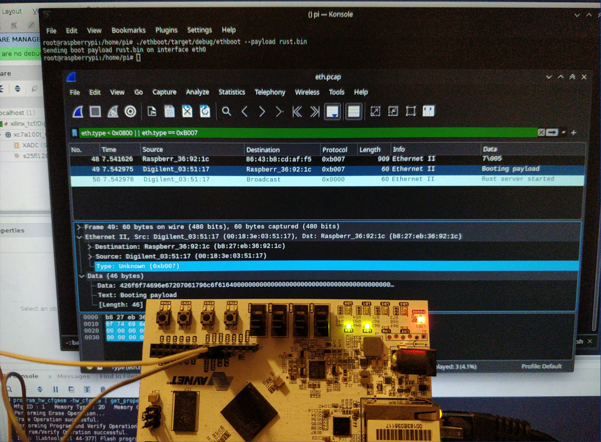

A hobby RISC-V RV64IMAC soft-core and minimal SoC targeting the Arty-A7 board (Xilinx Artix-7).  
Pictured is the CPU running a simple Rust server that receives an updated version of itself as a payload over the network and boots it.

## Verification, performance, and other optional details

This is a toy 64-bit CPU that has not been rigorously tested against the RISC-V compliance test suite or formally verified, and most likely still contains bugs.    
The core currently runs at a _blazing_ 65MHz (though it can close timing somewhat higher with some gentle encouragement from post-route phys_opt passes).  
It owes its name to the pipeline being full of bubbles, and is _firmly_ subscalar at all times =)

The core is configured with 2kiB of instruction cache, 2kiB of data cache, and 43 usable address bits.  
The ifetch follows simple branches, but only knows to predict the backwards conditional branches as taken.  
As there is only a single core, we get to support the A extension for atomic instructions for free.  
Some address bits can be configured to mark uncacheable address ranges, but there is otherwise no way to flush caches besides filling them in software (or a full reset of the core).

A notable quirk is that writes are not just started asynchronously, but the core _doesn't wait_ for the result!  
If a peripheral on the bus has to report a write error, we consider that software UB and exploit it with the fervor of a C++ compiler removing a load-bearing infinite loop, just dropping the write on the floor.  
It is still possible to issue a read to check for errors (those do trap), barring MMIO devices making your day more interesting by having arbitrary non-idempotent side effects.    

## Third-party code

The project includes some third-party code for specific components:
- [verilog-ethernet](https://github.com/alexforencich/verilog-ethernet/)'s MAC/PHY modules and AXI interfaces to it
- [wb2axip](https://github.com/ZipCPU/wb2axip)'s AXI4-Lite crossbar 

Due to the state of verilog tooling and package management being what it is,
instead of declaring a dependency on these, we currently just embed a copy of the third party modules we use under the src folder.  
